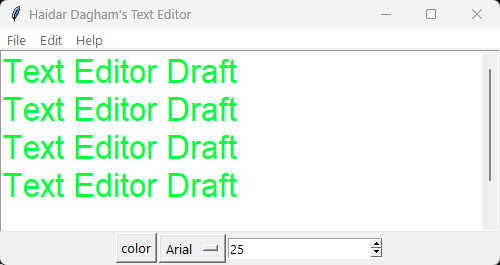

# Haidar Dagham's Text Editor 📝💻

A simple yet powerful **Text Editor** built with Python and Tkinter. This project supports basic text editing features like open, save, cut, copy, paste, font customization, color selection, and more — all in a clean and user-friendly interface.

---

## ✨ Features

- 📝 Edit text with full keyboard support  
- 📂 Open and save `.txt` files  
- 🔤 Choose font and size  
- 🎨 Change text color using a color picker  
- ✂️ Clipboard operations: cut, copy, paste  
- 🧠 "About" menu with developer info  
- 🎯 Centered startup window  
- 📦 Fully packaged `.exe` with custom icon

---

## 📸 Screenshots

<p align="center">
  <strong>'Text Editor' Desktop View</strong><br>
  
</p>

---

## 🚀 Running the Program

### 🐍 From Python Source

Make sure Python is installed on your system, then run:

```bash
python text_editor_program.py
```

Use the menu bar to interact with files and edit your content!

### 📦 As Executable (Windows .exe)

If you’ve downloaded the compiled version:

Just double-click on `text_editor_program.exe` to launch the editor — no Python required.

---

## 🛠 Build Info

- **Language:** Python 3  
- **Framework:** Tkinter  
- **Packaging Tool:** PyInstaller

### 🔧 Create the `.exe` File Yourself

1. Place `text_editor_program.py` and `icon.ico` in the same folder.
2. Open a terminal in that folder.
3. Run:

```bash
pyinstaller -F -w -i icon.ico text_editor_program.py
```

The compiled `.exe` will be available inside the `/dist` directory.

---

## 📁 Project Files

- `text_editor_program.py` – Main script  
- `text_editor_program.exe` – Compiled Windows executable  
- `icon.ico` – App icon file  
- `README.md` – This file

---

## 👨‍💻 Author

**Haidar Dagham**
